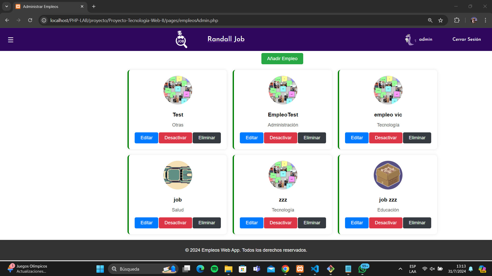

# Empleos Web App

Este proyecto es un sistema de gestión de empleos que permite a los usuarios buscar y postularse a empleos, y a los administradores gestionar ofertas de empleo, postulaciones y usuarios. Fue desarrollado como proyecto final para la materia de Tecnología Web II utilizando HTML, CSS, PHP, JavaScript y MySQL.

## Capturas de Pantalla

### Página de Inicio


### Registro de Usuario


### Login de Usuario


### Perfil


### Editar Perfil


### Dashboard del Administrador


### Gestión de Empleos por el Administrador


### Gestión de Usuarios por el Administrador


### Detalles de Postulación


## Funcionalidades

### Para los Usuarios

- **Registro de Usuario**: Permite a los usuarios registrarse proporcionando detalles como nombre, apellido, correo electrónico, teléfono, dirección, y foto.
- **Inicio de Sesión**: Los usuarios pueden iniciar sesión con su nombre de usuario o correo electrónico y contraseña.
- **Postulación a Empleos**: Los usuarios pueden buscar y postularse a empleos disponibles. Si no están registrados, se les pedirá que inicien sesión.
- **Visualización de Postulaciones**: Los usuarios pueden ver sus postulaciones y el estado de las mismas (espera, aceptado, rechazado).

### Para los Administradores

- **Dashboard**: Los administradores tienen acceso a un panel de control donde pueden ver estadísticas de usuarios y postulaciones.
- **Gestión de Empleos**: Los administradores pueden agregar, editar, activar/desactivar y eliminar empleos.
- **Gestión de Usuarios**: Los administradores pueden ver, agregar, editar y eliminar usuarios.
- **Gestión de Postulaciones**: Los administradores pueden ver todas las postulaciones y cambiar su estado (aceptar/rechazar).

## Instalación y Configuración

1. **Clonar el repositorio**
   ```bash
   git clone https://github.com/tu-usuario/empleos-web-app.git
   cd empleos-web-app

2. **Configurar la base de datos**

 - Importa el archivo database.sql en tu servidor MySQL.
 - Actualiza las credenciales de la base de datos en config/config.php.
 
3. **Configuración del servidor**
 - Asegúrate de tener un servidor web con soporte para PHP (como XAMPP, WAMP o LAMP).
 - Coloca los archivos del proyecto en el directorio raíz de tu servidor web.

4. **Acceder a la aplicación**
 - Abre tu navegador web y navega a http://localhost/empleos-web-app.

## Integrantes del Grupo 6
 - Daniel Mancilla
 - Victor Joel Taja
 - Santiago Tapia
 - Sebastian Zambrana
 - Hugo Acosta